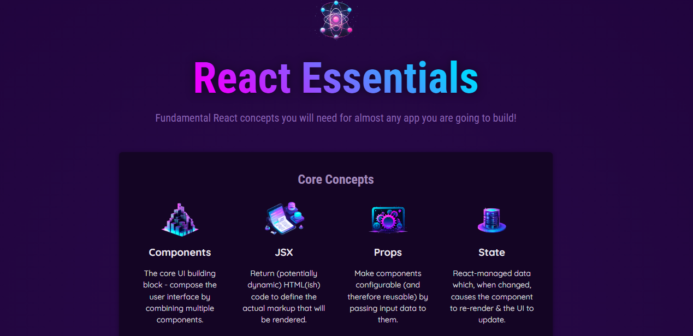
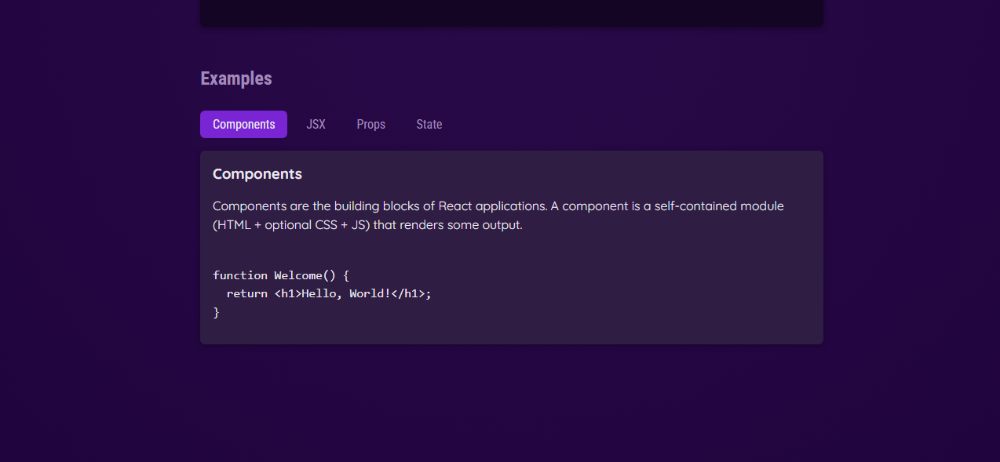

````markdown
# React Essentials Project

A modern React application built with Vite.

## 🚀 Getting Started

### Prerequisites

Make sure you have these installed:

1. **Node.js** (v16 or higher) - [Download](https://nodejs.org/)
2. **npm** (comes with Node.js) or **Yarn** - [Yarn Installation](https://yarnpkg.com/getting-started/install)

### Installation

1. Clone the repository:
   ```bash
   git clone https://github.com/kedarnathyadav/React-essentials.git
   ```
````

2. Navigate to project directory:
   ```bash
   cd React-essentials
   ```
3. Install dependencies:
   ```bash
   npm install
   ```
   or
   ```bash
   yarn install
   ```

### Available Scripts

Run these commands in the project directory:

| Command           | Description                      |
| ----------------- | -------------------------------- |
| `npm run dev`     | Starts development server        |
| `npm run build`   | Creates production build         |
| `npm run preview` | Locally preview production build |

### Development

To start the development server:

```bash
npm run dev
```

Open [http://localhost:5173](http://localhost:5173) in your browser.

### Building for Production

```bash
npm run build
```

The build artifacts will be stored in the `dist/` directory.

## Project Structure

```
├── src/
│   ├── main.jsx       # Application entry point
│   ├── App.jsx        # Root component
│   └── assets/        # Static assets
├── public/            # Public assets
├── vite.config.js     # Vite configuration
└── package.json       # Project dependencies
```

## 📝 Notes

- Uses Vite for fast development builds
- React 18 with modern features
- Configured for optimal production builds

## 📸 Screenshots

<div align="center">
  
  
</div>
